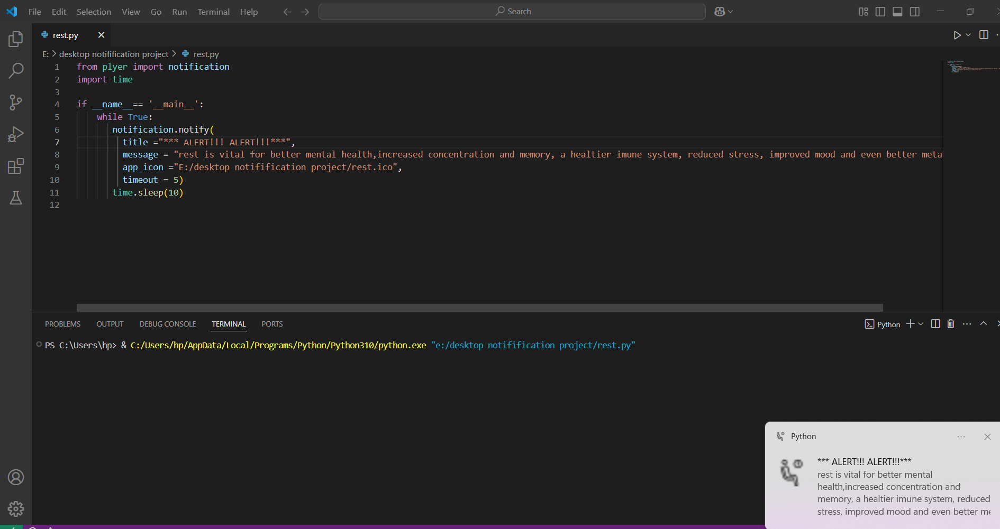

# 🛎️ Desktop Notification Project - Rest Reminder

A Python-based desktop notification system that reminds users to take breaks at regular intervals for better health and productivity. This tool promotes wellness by sending custom alerts about the importance of rest.

## 📸 Preview



## 🧰 Features

- Sends periodic notifications with custom messages
- Supports icons for visual context
- Easy to configure duration and frequency
- Lightweight and minimal setup required

## 🛠️ Technologies Used

- Python 3.x
- [Plyer](https://plyer.readthedocs.io/en/latest/) – for cross-platform notifications
- Time module – to create intervals between alerts

## ⚙️ How It Works

The script sends a desktop alert every 10 seconds with a message about the benefits of taking rest, using an icon of your choice.

## 💻 Setup Instructions

1. Clone the repo or download the script.
2. Install the required package:
   ```bash
   pip install plyer

